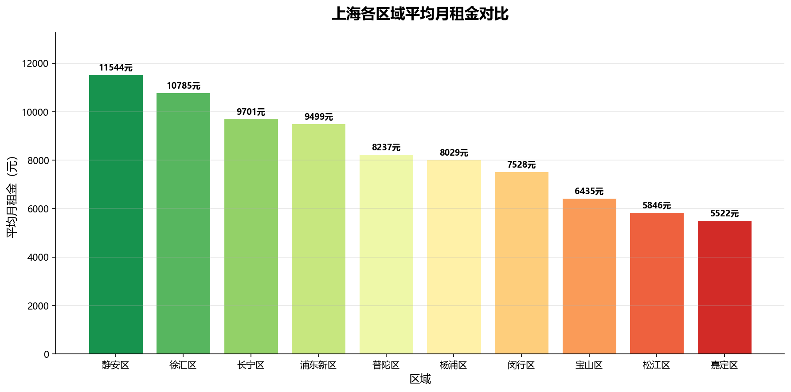
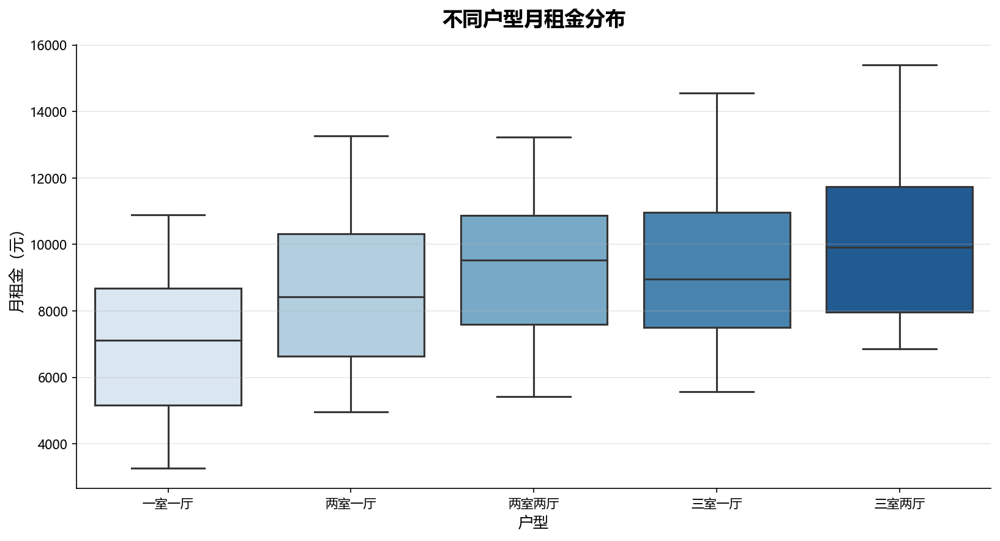
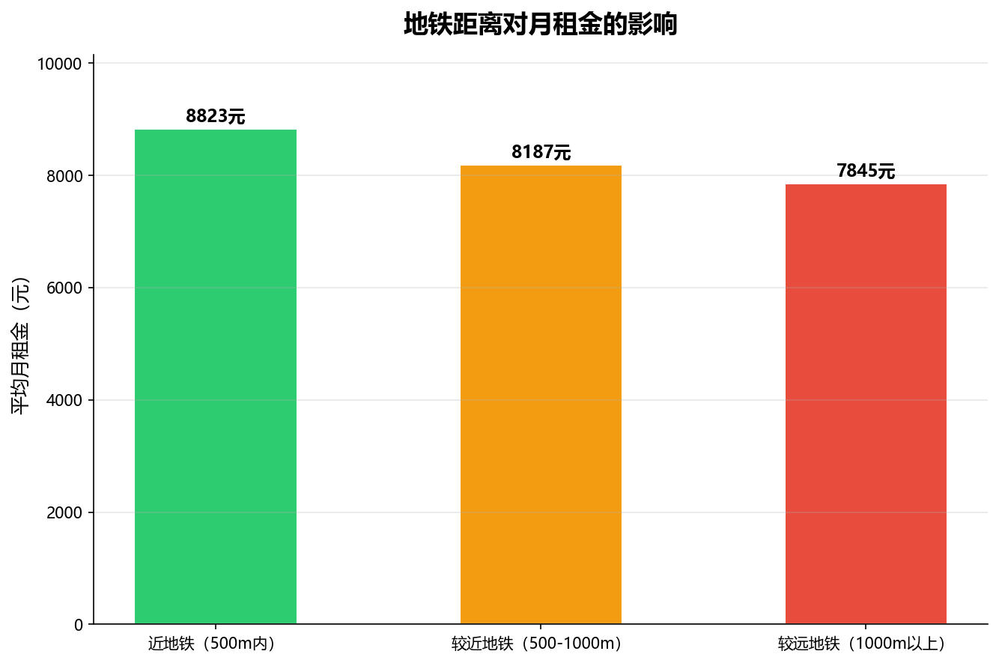
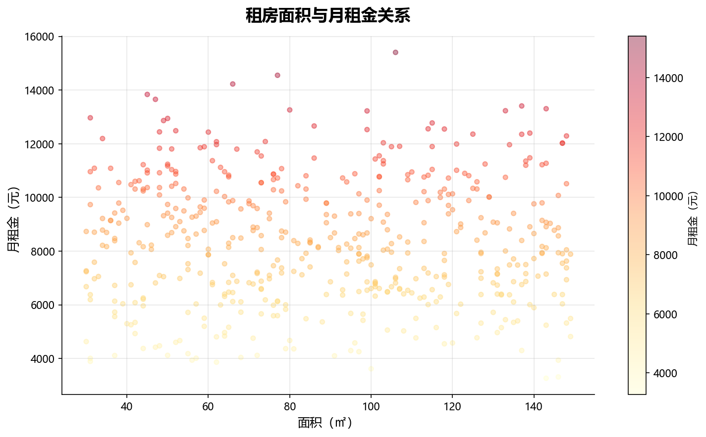

# 🏠 上海租房市场数据分析

> 基于500条租房数据，分析上海各区域租金水平、户型差异及地铁距离对租金的影响。

**技术栈**：Python · Pandas · Matplotlib · Seaborn · NumPy

---

## 📊 分析结论

- **静安区、徐汇区**租金最高，均价超过1万元；**嘉定区、松江区**性价比最高，均价约5500元
- 户型越大租金越高，三室两厅中位数约为一室一厅的**1.4倍**
- 近地铁（500m内）房源比远地铁房源平均贵约**12%**
- 面积与租金存在正相关，但区域因素影响更显著

---

## 📈 可视化结果

### 各区域平均月租金对比


### 不同户型租金分布


### 地铁距离对租金的影响


### 面积与租金关系


---

## 📁 项目结构
```
rental-market-analysis/
├── generate_data.py    # 数据生成脚本
├── analysis.py         # 数据分析与可视化
├── data/
│   └── shanghai_rental.csv   # 数据集（500条）
└── output/             # 生成的图表
```

---

## 🚀 快速运行
```bash
pip install pandas matplotlib seaborn
python generate_data.py
python analysis.py
```

---

## 📌 数据说明

本项目使用模拟数据，基于上海真实租房市场的价格区间构建，涵盖10个行政区、5种户型、3种地铁距离分类，共500条记录。
